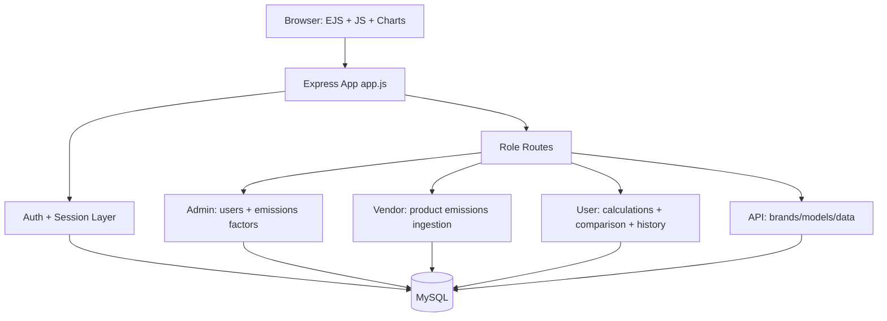

# Carbon Calculator Platform

> A role-based web app for laptop lifecycle carbon analysis with vendor data ingestion, country-level emission factors, user-side comparison dashboards, and admin controls.


---

## Why this project?

Hardware sustainability decisions are often made with incomplete data. This platform gives three stakeholder views:

1. **Vendors** upload or enter laptop product emission profiles
2. **Admins** manage regional emissions factors and account roles
3. **Users** estimate device-level lifecycle impact and compare options visually

The result is a practical workflow for turning raw product data into understandable carbon insights.

---

## Quick Start

### Option A — Local (Node.js)

#### 1. Install dependencies

```bash
npm install
```

#### 2. Configure database connection

Update credentials/host in `db.js` for your MySQL server.

The app currently expects:

- SSL CA file at `public/DigiCertGlobalRootCA.crt.pem`
- MySQL database containing required tables (see Data Model section)

#### 3. Build frontend bundle (optional but recommended)

```bash
npm run build
```

#### 4. Start the application

```bash
npm start
```

By default, the app runs on `http://localhost:4000`.

---

### Option B — Docker

#### 1. Build the image

```bash
docker build -t carbon-calculator .
```

#### 2. Run the container

```bash
docker run -p 4000:4000 \
  -e SESSION_SECRET=your_secret_here \
  -e DB_HOST=your_db_host \
  -e DB_USER=your_db_user \
  -e DB_PASSWORD=your_db_password \
  -e DB_NAME=your_db_name \
  carbon-calculator
```

The app will be available at `http://localhost:4000`.

> **Note:** The container does not include MySQL. Point `DB_HOST` at an external MySQL instance or run one via Docker Compose.

#### Docker Compose (app + MySQL)

```yaml
version: "3.9"
services:
  app:
    image: carbon-calculator
    build: .
    ports:
      - "4000:4000"
    environment:
      SESSION_SECRET: change_me
      DB_HOST: db
      DB_USER: root
      DB_PASSWORD: rootpass
      DB_NAME: carbon
    depends_on:
      - db

  db:
    image: mysql:8.0
    environment:
      MYSQL_ROOT_PASSWORD: rootpass
      MYSQL_DATABASE: carbon
    volumes:
      - mysql_data:/var/lib/mysql

volumes:
  mysql_data:
```

---

## System Overview



---

## Core Flows

### Flow 1: Registration and Login

1. User registers with role (`admin`, `vendor`, or `user`)
2. Password is hashed with `bcrypt`
3. Verification token is emailed via `nodemailer`
4. After verification, login returns redirect target by role:
	 - `/admin/welcome`
	 - `/vendor/welcome`
	 - `/user/welcome`

### Flow 2: Vendor Data Ingestion

1. Vendor opens `/vendor/action`
2. Submits emissions data manually or uploads `.xls/.xlsx`
3. Rows are inserted into `ProductEmissions`
4. Vendor can fetch and update previously submitted records

### Flow 3: User Carbon Comparison

1. User selects hardware specs + usage context in `/user/actions`
2. App fetches product composition percentages from `productemissions`
3. Country factors from `emissions_factor` adjust component emissions
4. API returns per-component totals and aggregated lifecycle impact
5. Search is saved in `user_searches` for history view

### Flow 4: Admin Governance

1. Admin manages country/component emission factors
2. Admin can update user roles and remove users
3. Self-demotion or self-delete protection is enforced in routes

---

## Tech Stack

- **Backend**: Node.js, Express
- **Templating**: EJS
- **Database**: MySQL (`mysql2` promise pool)
- **Auth/Security**: `express-session`, `bcrypt`, Passport (Google/Facebook strategy scaffolding)
- **Email**: Nodemailer
- **Data Upload**: Multer + XLSX
- **Visualization/Export**: Chart.js, jsPDF, html2canvas, DataTables
- **Build**: Webpack

---

## API and Route Surface

### Authentication (`/auth`)

| Method | Endpoint | Description |
|---|---|---|
| `GET` | `/auth/login` | Render login page |
| `POST` | `/auth/login` | Validate credentials and return role redirect |
| `POST` | `/auth/register` | Register user + send email verification |
| `GET` | `/auth/verify-email/:token` | Verify email token |
| `POST` | `/auth/logout` | Logout and destroy session |
| `GET` | `/auth/redirect/:role` | Role-based redirect router |

### Admin (`/admin`)

| Method | Endpoint | Description |
|---|---|---|
| `GET` | `/admin/welcome` | User management view |
| `GET` | `/admin/action` | Emission factor admin view |
| `POST` | `/admin/api/emissions` | Add country/component emissions factor |
| `PATCH` | `/admin/api/emissions/:country/:component` | Update emissions factor |
| `PATCH` | `/admin/users/:userId/role` | Change user role |
| `DELETE` | `/admin/users/:userId` | Delete user |

### Vendor (`/vendor`)

| Method | Endpoint | Description |
|---|---|---|
| `GET` | `/vendor/welcome` | Vendor home |
| `GET` | `/vendor/action` | Vendor data entry page |
| `POST` | `/vendor/submit-emissions-data` | Insert one product emissions record |
| `POST` | `/vendor/upload-xls` | Bulk import spreadsheet |
| `GET` | `/vendor/fetch-data` | Fetch vendor records |
| `POST` | `/vendor/update` | Update existing product emissions record |
| `GET` | `/vendor/test.xlsx` | Download upload template |

### User (`/user`)

| Method | Endpoint | Description |
|---|---|---|
| `GET` | `/user/welcome` | User dashboard/home |
| `GET` | `/user/actions` | Calculator and comparison page |
| `GET` | `/user/chart-data` | Single selection emissions calculation |
| `POST` | `/user/multi-chart-data` | Multi-device emissions payload |
| `POST` | `/user/save-search` | Persist user query and result |
| `GET` | `/user/search-history` | Fetch saved calculations |
| `GET` | `/user/unique-brands` | Distinct brands |
| `GET` | `/user/unique-models` | Distinct models by brand |
| `GET` | `/user/unique-processors` | Distinct processors by brand/model |
| `GET` | `/user/unique-ram` | Distinct RAM options |
| `GET` | `/user/unique-storage` | Distinct storage options |
| `GET` | `/user/unique-screen-size` | Distinct screen sizes |
| `GET` | `/user/unique-location` | Distinct locations for selected device |

### Generic API (`/api`)

| Method | Endpoint | Description |
|---|---|---|
| `GET` | `/api/unique-brands` | Distinct brands from `carbon_emissions` |
| `GET` | `/api/unique-models-api` | Distinct models by brand |
| `GET` | `/api/fetch-data` | Vendor-specific emissions data |

---

## Data Model (Required Tables)

### `users_registration`

Used for identity, roles, and email verification.

Suggested columns:

- `id` (PK)
- `username`
- `email`
- `password` (bcrypt hash)
- `role` (`admin` | `vendor` | `user`)
- `email_verified` (boolean/int)
- `verification_token` (nullable)

### `ProductEmissions` / `productemissions`

Stores vendor-provided device footprint composition.

Key columns referenced in code:

- `vendor_id`, `brand`, `model`, `processor`, `ram`, `storage`, `screen_size`, `date`
- `total_co2`
- `% components: transportation, packaging, display, soc, battery, power_supply_unit, optical_drive, storage_drive, chassis, end_of_life, device_usage`

### `carbon_emissions`

Also used by some endpoints for emission component values.

Key columns referenced:

- `vendor_id`, `brand`, `model`, `processor`, `ram`, `storage`, `screen_size`, `location`
- `end_of_life`, `product_use`, `transport`, `packaging`, `production`, `scope_2`, `scope_3`

### `emissions_factor`

Admin-managed adjustment factors by country and component.

Key columns:

- `country`
- `component`
- `emissions_factor`

### `user_searches`

Stores user calculator history.

Key columns:

- `user_id`, `brand`, `model`, `processor`, `ram`, `storage`, `location`, `screen_size`
- `years`, `quantity`, `total_carbon_emissions`

---

## Project Structure

```text
carbon-calculator/
├── app.js                        # Express bootstrap and route mounting
├── db.js                         # MySQL pool and SSL configuration
├── routes/
│   ├── auth.js                   # Registration, login, verification, redirects
│   ├── admin.js                  # Admin views and management APIs
│   ├── vendor.js                 # Vendor upload/data routes
│   ├── user.js                   # User calculator and history routes
│   └── api.js                    # Generic JSON endpoints
├── views/                        # EJS templates per role and shared layout
├── public/                       # Static assets and client-side scripts
├── store/                        # In-memory data store modules
├── uploads/                      # Multer upload target for spreadsheets
├── Dockerfile                    # Multi-stage production image
├── .dockerignore
├── .github/
│   └── workflows/
│       └── docker.yml            # CI pipeline: build + push to ghcr.io
├── webpack.config.js             # Bundle config
└── package.json
```

---

## Notes for Production Hardening

The current codebase is functional for development/demo usage, but before production deployment you should:

1. Move DB credentials, session secret, and mail credentials out of source code into environment variables.
2. Add CSRF and stronger session/cookie settings.
3. Add schema migrations and a canonical SQL setup script.
4. Add automated tests for route guards and calculation correctness.
5. Normalize table naming (`ProductEmissions` vs `productemissions`) to avoid case-sensitivity issues across environments.

---

## CI / CD

The repository ships a GitHub Actions workflow at [.github/workflows/docker.yml](.github/workflows/docker.yml).

**What it does on every push to `main` or `master`:**

1. Checks out the code
2. Logs in to the GitHub Container Registry (`ghcr.io`) using the built-in `GITHUB_TOKEN` — no extra secrets required
3. Builds the Docker image using the multi-stage `Dockerfile`
4. Pushes two tags:
   - `ghcr.io/<owner>/<repo>:latest`
   - `ghcr.io/<owner>/<repo>:sha-<short-git-sha>`

On pull requests the image is **built but not pushed**, so CI still validates the `Dockerfile` for every PR.

Layer caching via GitHub Actions cache (`cache-from/cache-to: type=gha`) keeps subsequent builds fast.

### Pull the published image

```bash
docker pull ghcr.io/<your-github-username>/carbon-calculator:latest
```

---

## Run Commands

```bash
# Install
npm install

# Build bundle
npm run build

# Start app
npm start

# Docker build
docker build -t carbon-calculator .

# Docker run
docker run -p 4000:4000 carbon-calculator
```

---

## License

No license file is currently defined in this repository.
